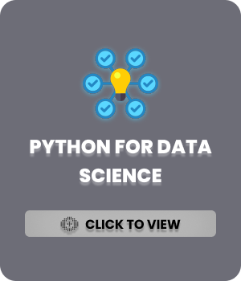

<!-- 🖼️ BANNER -->

  

<!-- 🔵 4 STACKED BADGES  -->

  
  
  
  

<!-- 🟣 SOCIAL + PORTFOLIO BADGES -->

  
 
  
  
  
   
  
  
  
  

## 📡 STATUS

  

 

## 🏙️ PROJECTS 

 
 
 
 

 

## 📄 ARTICLES

  
  
  

 

## 🎓 CERTIFICATIONS

  
  
  

  

<!-- FOOTER -->

  

